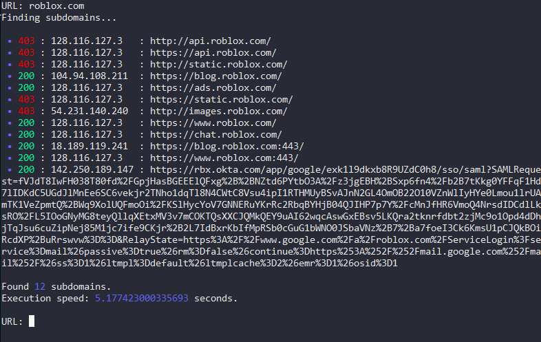

# SubScan ~ By Lore<3

### A working subdomain scanner in python.



```bash
To add more subdomains just add into lib/subdomains.txt
```


## 🔌 How To Install:
```bash
1. git clone https://github.com/PyLore/SubScan-By-Lore
2. cd <directory folder is in>
3. py main.py or python3 main.py
```
